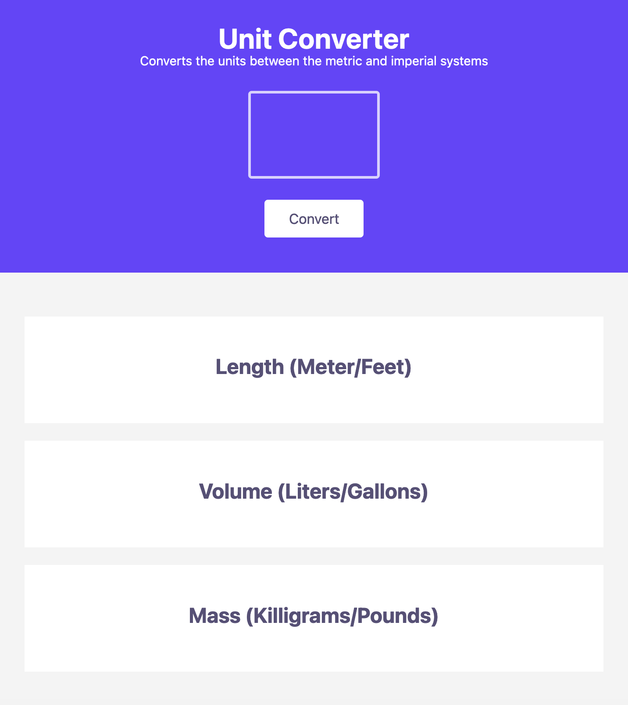
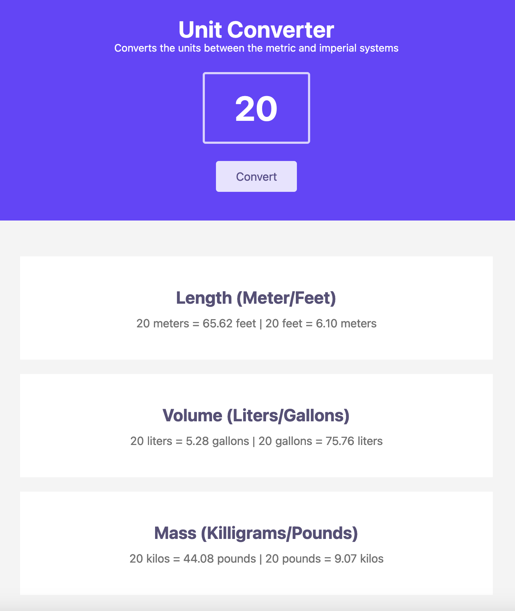
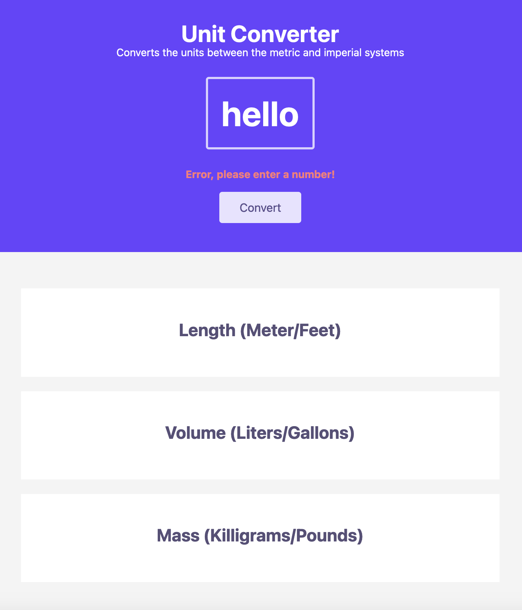

# Unit Converter

## Description

Credit to Scrimba.com for the project idea.

This is one of the solo projects that I was tasked with by Scrimba to develop my JavaScript skills via their 'Learn JavaScript' course.

This project takes in a value (number) from the input field and when the 'convert' button is pressed, the results are passed into the their relevant sections on the DOM. If the value is not a number, then an error message will pop up and inform the user.

This project converts units between 'metric' and the 'imperial' systems. For example, is you entered '20' as a value and pressed the convert button, the project would convert tell you what 20 meters in feet is and also vice versa (20 feet in meters).

## Screenshots

## Credits

Scrimba.com for the project idea.

## License

MIT License

Copyright (c) [2024] [Curtis Bowen]

Permission is hereby granted, free of charge, to any person obtaining a copy
of this software and associated documentation files (the "Software"), to deal
in the Software without restriction, including without limitation the rights
to use, copy, modify, merge, publish, distribute, sublicense, and/or sell
copies of the Software, and to permit persons to whom the Software is
furnished to do so, subject to the following conditions:

The above copyright notice and this permission notice shall be included in all
copies or substantial portions of the Software.

THE SOFTWARE IS PROVIDED "AS IS", WITHOUT WARRANTY OF ANY KIND, EXPRESS OR
IMPLIED, INCLUDING BUT NOT LIMITED TO THE WARRANTIES OF MERCHANTABILITY,
FITNESS FOR A PARTICULAR PURPOSE AND NONINFRINGEMENT. IN NO EVENT SHALL THE
AUTHORS OR COPYRIGHT HOLDERS BE LIABLE FOR ANY CLAIM, DAMAGES OR OTHER
LIABILITY, WHETHER IN AN ACTION OF CONTRACT, TORT OR OTHERWISE, ARISING FROM,
OUT OF OR IN CONNECTION WITH THE SOFTWARE OR THE USE OR OTHER DEALINGS IN THE
SOFTWARE.
